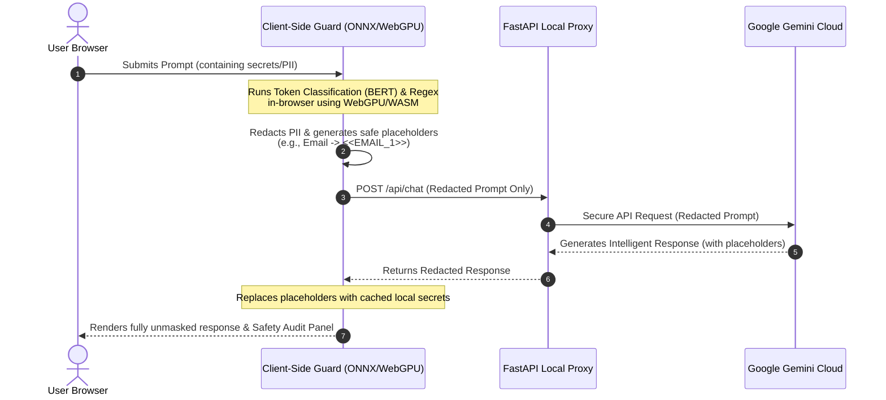

# Project O3: Secure AI Chat Assistant with WebGPU-Accelerated Client-Side PII Guardrails

Project O3 is a secure, privacy-first AI chat interface that guarantees sensitive Personally Identifiable Information (PII) and secret credentials never leave your local machine. 

By utilizing **in-browser machine learning (WebGPU/WASM)** and high-performance client-side regular expression engines, Project O3 redacts all sensitive data locally before forwarding prompt payloads to the cloud, seamlessly restoring (unmasking) the original information once the secure response is received back from Google Gemini.

---

## 🚀 How It Works (Zero-Trust Privacy Loop)



1. **Client-Side Guardrails**: Your prompt is processed completely in-browser. A tiny, specialized BERT model (`bert-small-pii-detection-ONNX` via Hugging Face Transformers.js) runs locally (accelerated by **WebGPU/WASM**), while fallback regex engines scan for high-entropy secrets (GitHub tokens, AWS keys, credit cards, emails, and passwords).
2. **Local Masking**: Any detected sensitive information is immediately replaced with secure placeholders (e.g., `<<EMAIL_1>>`, `<<GITHUB_TOKEN_1>>`) before any data leaves your browser.
3. **Cloud Intelligence**: The sanitized, secure prompt is proxied through a local FastAPI server directly to Google's **Gemini 1.5 Flash** for high-quality, smart reasoning.
4. **Auto-Unmasking**: The response is returned to the browser, where placeholders are seamlessly unmasked locally using the browser's transient memory, showing you the full context without ever exposing raw secrets to the cloud.

---

## ✨ Features

- **WebGPU-Accelerated PII Classification**: Uses ONNX runtime inside the browser to run a high-accuracy token-classification model locally.
- **Hybrid Guardrail Pipeline**: Seamlessly combines client-side deep learning with precise regex scanners for comprehensive protection.
- **Robust Local Masking**: Covers emails, passwords, credit cards, GitHub Personal Access Tokens, AWS Access Keys, and high-entropy API secrets.
- **Zero-Cloud Leakage**: The backend server and Gemini Cloud only ever see your safe, masked inputs.
- **Interactive Safety Audit Panel**: Visually displays every token that was identified, masked, and safely restored.
- **Sleek, Premium UI**: Modern, dark-themed responsive user interface inspired by premium AI platforms, featuring fluid Orb animations, glowing Aurora canvas effects, and Framer Motion transitions.
- **Local History Persistence**: Saves your secure chat sessions locally using browser `localStorage`.

---

## 🛠️ Tech Stack

- **Frontend**: React 19, Vite, Hugging Face Transformers.js (`@huggingface/transformers`), Framer Motion, TailwindCSS v4.
- **Backend**: FastAPI, Google GenAI SDK (`google-genai` 0.3.0), Uvicorn.

---

## ⚙️ Setup & Installation

### Prerequisites

- Python 3.9+
- Node.js 18+
- Google Gemini API Key

---

### Backend Setup

1. **Navigate to the backend folder**:
   ```bash
   cd backend
   ```

2. **Create a virtual environment (recommended)**:
   ```bash
   python -m venv .venv
   # Windows
   .\.venv\Scripts\activate
   # macOS/Linux
   source .venv/bin/activate
   ```

3. **Install python dependencies**:
   ```bash
   pip install -r requirements.txt
   ```

4. **Add your Gemini API Key**:
   Create a `config.py` file in the `backend/` directory:
   ```python
   # config.py
   GEMINI_API_KEY = "your-gemini-api-key-here"
   ```
   *(Note: `config.py` is ignored by Git to protect your credentials)*

5. **Start the FastAPI server**:
   ```bash
   python main.py
   ```
   The backend server will run at [http://127.0.0.1:8000](http://127.0.0.1:8000).

---

### Frontend Setup

1. **Open a new terminal and navigate to the frontend folder**:
   ```bash
   cd frontend
   ```

2. **Install node dependencies**:
   ```bash
   npm install
   ```

3. **Start the Vite dev server**:
   ```bash
   npm run dev
   ```
   Open your browser and visit the address shown in your terminal (typically [http://localhost:5173](http://localhost:5173)).

---

## 🛡️ PII & Credentials Covered

- **Emails** (Regex & BERT)
- **Passwords** (Regex & BERT)
- **GitHub Personal Access Tokens** (Regex)
- **AWS Access Keys** (Regex)
- **Credit Cards** (Regex)
- **High-Entropy Secrets & API Keys** (Regex)
